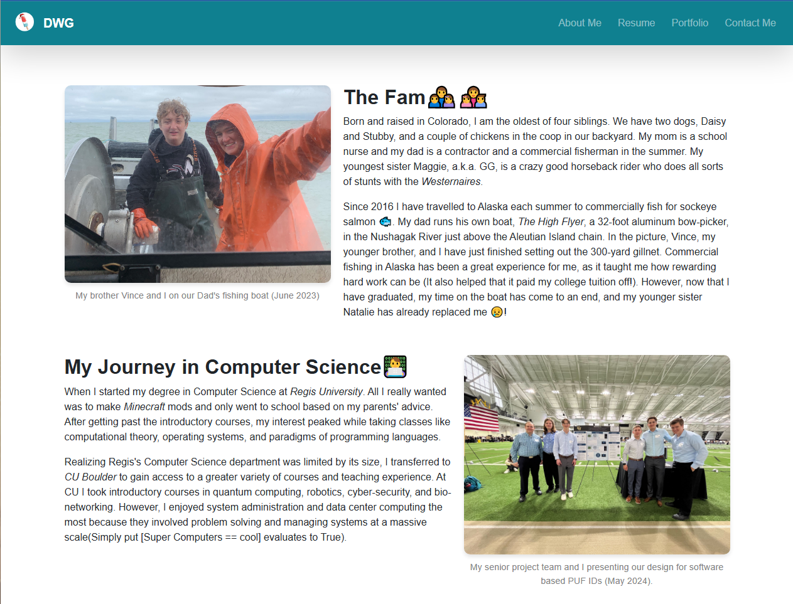

# My Personal Website
Built by Dominic Galgano

### Description
This is the code I use to run my personal website. It uses Flask and Jinja to load the HTML templates I have built from scratch. The website has 4 pages, About Me(also the home page),
My Resume, Projects, and Contact Me. 

### Preview
Here is a screenshot of how the My Resume page looks when the website is running

### How to Access
I setup this website to run using a custom domain name using No-IP's free 1 free domain name
option. Visit this URL: [dwg.serverhttp.com](dwg.serverhttp.com)
